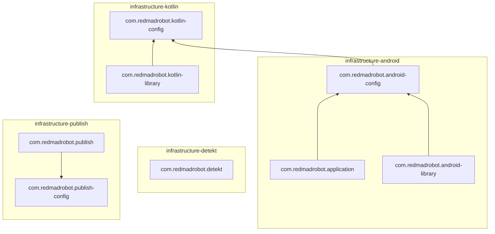

# Gradle Infrastructure <GitHub path="RedMadRobot/gradle-infrastructure"/>
[][mavenCentral]
[][ci]
[][license]

Small plugins to reduce boilerplate in Gradle build scripts.

> [!IMPORTANT]
> These plugins are designed to be used with Gradle Kotlin DSL only.

---
<!-- START doctoc generated TOC please keep comment here to allow auto update -->
<!-- DON'T EDIT THIS SECTION, INSTEAD RE-RUN doctoc TO UPDATE -->

- [Installation](#installation)
  - [Compatibility](#compatibility)
- [Plugins](#plugins)
  - [kotlin-library](#kotlin-library)
  - [publish](#publish)
  - [detekt](#detekt)
- [Android Plugins](#android-plugins)
  - [application and android-library](#application-and-android-library)
- [Usage](#usage)
  - [Add KGP and AGP to build dependencies](#add-kgp-and-agp-to-build-dependencies)
  - [Configuration](#configuration)
  - [Align version of all Kotlin libraries](#align-version-of-all-kotlin-libraries)
  - [Warnings as errors](#warnings-as-errors)
  - [Share sources between build variants](#share-sources-between-build-variants)
  - [Enable Detekt checks only on changed files](#enable-detekt-checks-only-on-changed-files)
  - [Configure JUnit test execution options](#configure-junit-test-execution-options)
  - [Automatically added repositories](#automatically-added-repositories)
- [Samples](#samples)
- [Troubleshooting](#troubleshooting)
  - [Tests failed - `No value has been specified for property 'localResourcesFile'`](#tests-failed---no-value-has-been-specified-for-property-localresourcesfile)
  - [`Android resource linking failed` or `Unresolved reference: R`](#android-resource-linking-failed-or-unresolved-reference-r)
  - [Build failed on CI - `No version of NDK matched the requested version`](#build-failed-on-ci---no-version-of-ndk-matched-the-requested-version)
  - [`Could not resolve` or `Could not find` dependencies](#could-not-resolve-or-could-not-find-dependencies)
- [Contributing](#contributing)
- [License](#license)

<!-- END doctoc generated TOC please keep comment here to allow auto update -->

## Installation

If you're planning to use android plugins, add Google repository to `settings.gradle.kts`:

```kotlin
pluginManagement {
    repositories {
        google() // Required if you use infrastructure-android
        gradlePluginPortal()
    }
}
```

Then you can apply any of plugins where you need:

```kotlin
plugins {
    id("com.redmadrobot.kotlin-library") version "0.19"
    id("com.redmadrobot.publish") version "0.19"
    id("com.redmadrobot.detekt") version "0.19"
    id("com.redmadrobot.application") version "0.19"
    id("com.redmadrobot.android-library") version "0.19"
}
```

> For `kotlin-library` and android-related plugins, you should also add Kotlin Gradle Plugin or Android Gradle Plugin to project build dependencies.\
> [Read more...](#add-kgp-and-agp-to-build-dependencies)

If you want to configure subprojects from root project, you can apply `*-config` plugins to root project.
This way subprojects will use configs from parent projects as defaults.

`./build.gradle.kts`:

```kotlin
plugins {
    id("com.redmadrobot.android-config")
}

redmadrobot {
    android {
        minSdk = 28
    }
}
```

`./app/build/build.gradle.kts`:

```kotlin
plugins {
    id("com.redmadrobot.application")
}

// Will be used minSdk = 28 by default
android {
    // ...
}
```

*Look at [samples](#samples) for quick start.*

### Compatibility

| gradle-infrastructure | Minimal Gradle version | Minimal KGP version | Minimal AGP version |
|----------------------:|:----------------------:|:-------------------:|:-------------------:|
|              **0.19** |          8.0           |        1.9.0        |        8.4.0        |
|              **0.18** |          7.5           |       1.7.10        |        7.4.0        |
|              **0.17** |          7.2           |       1.7.10        |        7.1.0        |

## Plugins



### kotlin-library

Common configurations for pure Kotlin libraries.

- Applies plugin `kotlin`
- Enables [explicit API mode][explicit-api]

### publish

Common publish configurations for both Android and Kotlin libraries.

- Applies plugin `maven-publish`
- Adds sources and javadocs to publication

You should specify publishing repositories manually. You can also use [predicates] for publication:

```kotlin
publishing {
    repositories {
        // Unconditional publication
        rmrNexus()
        // Publication with conditions
        if (isRunningOnCi) githubPackages("RedMadRobot/gradle-infrastructure")
        if (isReleaseVersion && credentialsExist("ossrh")) ossrh()
    }
}
```

#### Signing

You can configure publication via extension `redmadrobot.publishing`:

```kotlin
redmadrobot {
    publishing {
        signArtifacts = true // Enables artifacts signing, required for publication to OSSRH
        useGpgAgent = true   // By default use gpg-agent for artifacts signing
    }
}
```

Read more about singing configuration in [Signing Plugin][signing-plugin] docs.

#### Customize POM

You can configure POM properties common for all modules.

> Note: there are extension-functions to simplify common configuration use-cases.
> All available extensions you can find [here][MavenPom].

```kotlin
redmadrobot {
    publishing {
        pom {
            // Configure <url>, <scm> and <issueManagement> tags for GitHub project by it's name
            setGitHubProject("RedMadRobot/gradle-infrastructure")
            
            licenses { 
                mit() // Add MIT license
            }
            
            developers {
                // Shorthand to add a developer
                developer(id = "j.doe", name = "John Doe", email = "john@doe.com")
            }
        }
    }
}
```

#### Customize publication for module

Use `publishing` extension in module build script to configure publication for the single module.
Take publication name from `PUBLICATION_NAME` constant.
Read more in [Maven Publish plugin][maven-publish] docs.

```kotlin
publishing {
    publications {
        getByName<MavenPublication>(PUBLICATION_NAME) {
            // Configure publication here
        }
    }
}

// or even shorter
publishing.publications.getByName<MavenPublication>(PUBLICATION_NAME) {
    // Configure publication here
}
```

### detekt

- Applies `detekt` plugin with `detekt-formatting`
- Configures additional tasks:
    - `detektAll` - Runs Detekt over the whole codebase
    - `detektBaselineAll` Creates single baseline file in the config directory with issues from the `detektAll` task.
    - `detektFormat` - Reformats the whole codebase with Detekt
    - `detektDiff` - Runs Detekt only on changed files (see [Enable Detekt checks only on changed files](#enable-detekt-checks-only-on-changed-files))
    - `detekt[Variant]All` - Runs Detekt checks with type resolution on specified build variant (example `detektDebugAll`) or main source set (`detektMainAll`) if project is non-android
    - `detektBaseline[Variant]All` Creates single baseline file in the config directory with issues from the `detekt[Variant]All` task.

> :warning: only `detekt[Variant]All` tasks are compatible with [**type resolution**][type-resolution]. 

## Android Plugins

### application and android-library

Common configurations for Android libraries and application.

[Both][BaseAndroidPlugin]:
- Specifies default compile, min and target SDK
- Disables `shaders` [build-features] by default
- Applies [android-cache-fix-gradle-plugin](https://github.com/gradle/android-cache-fix-gradle-plugin)
- Configures Android Lint with [defaults][lint-options]
- [Filters tests][testTaskFilter] to be run on `test` task according to the config.
  By default, keeps only tests for build type `release`.

[Library][AndroidLibraryPlugin]:
- Applies plugin `com.android.library`
- Adds all proguard files from `proguard` folder as `consumerProguardFiles`
- Disables `androidResources` and `resValues` [build-features] by default
- Enables [explicit API mode][explicit-api]

[Application][AndroidApplicationPlugin]:
- Applies plugin `com.android.application`
- Adds all proguard files from `proguard` folder
- Configures `debug`, `qa` and `release` build types

#### QA build type name configuration

By default, for QA builds used name "qa", but you can configure `BUILD_TYPE_QA` via `gradle.properties`:

```properties
# Override QA build type name
redmadrobot.android.build.type.qa=staging
```

## Usage

### Add KGP and AGP to build dependencies

> Starting from gradle-infrastructure **0.18** KGP and AGP removed from transitive dependencies, so you should manually
> add it to project build dependencies.

`kotlin-library` plugin requires Kotlin Gradle Plugin to work.
Android-related plugins requires both KGP and AGP.

You can use two different approaches to add plugin as a build dependency:

1. Add needed plugins to top-level `build.gradle.kts` with `apply false`:
   ```kotlin
   // (root)/build.gradle.kts

   plugins {
       // Use `apply false` in the top-level build.gradle file to add a Gradle 
       // plugin as a build dependency but not apply it to the current (root) project.
       // Here you can specify desired AGP and KGP versions to use.
       id("com.android.application") version "7.4.2" apply false
       id("org.jetbrains.kotlin.android") version "1.8.10" apply false
   }
   ```

2. If you have `buildSrc` or some other module containing build logic, you can add plugins to `dependencies` of this
   module:
   ```kotlin
   // (root)/buildSrc/build.gradle.kts
   
   dependencies {
       // Here you can specify desired AGP and KGP versions to use.
       implementation(kotlin("gradle-plugin", version = "1.8.10"))
       implementation("com.android.tools.build:gradle:7.4.2")
   }
   ```

See [compatibility table](#compatibility) to check what versions are compatible with `gradle-infrastructure`.

### Configuration

You can configure the plugins via the `redmadrobot` extension.
Here are listed all available options, with their default values:

```kotlin
redmadrobot {
    /* Common options */
    // Directory with configs for static analyzers and other tools.
    configsDir = file("config/")

    // Directory with reports of static analyzers and other tools.
    reportsDir = file("build/reports/")

    /* `kotlin-config` options */
    test {
        // Specifies that JUnit Platform (JUnit 5) should be used to execute tests.
        useJunitPlatform()

        // Specifies that JUnit 4 should be used to execute tests.
        useJunit()
    }

    /* `android-config` options */
    android {
        // minSdk to be used in all android modules.
        minSdk = 23

        // targetSdk to be used in all android modules.
        targetSdk = 34

        // compileSdk to be used in all android modules
        compileSdk = "34"

        // Build Tools version to be used in all android modules.
        buildToolsVersion = System.getenv("ANDROID_BUILD_TOOLS_VERSION")

        // NDK version to be used in all android modules.
        ndkVersion = System.getenv("ANDROID_NDK_VERSION")

        // Filter for test tasks that should be run on ':test'.
        testTasksFilter = { taskProvider -> taskProvider.name.endsWith("ReleaseUnitTest") }
    
        // Overrides of test configuration for android projects
        test { /* ... */ }
    }
    
    /* `detekt` options */
    detekt {
        // Enable Detekt checks only for modified files
        // (Disabled by default)
        checkOnlyDiffWithBranch(branch = "main") {
            fileExtensions = setOf(".kt", ".kts")
        }
    }

    /* `publish-config` options */
    publishing {
        // Enables artifacts signing before publication.
        signArtifacts = false

        // Use gpg-agent to sign artifacts. Has effect only if signArtifacts is `true`.
        useGpgAgent = true

        // Configures POM file for this project and its subprojects.
        pom { /* ... */ }
    }
}
```

### Align version of all Kotlin libraries

> It is not a part of **gradle-infrastructure**, but it is important to know.

To align the Kotlin version for all dependencies including transitive ones, use `kotlin-bom`:

```kotlin
dependencies {
    // Align versions of all Kotlin components 
    implementation(platform(kotlin("bom", version = "1.8.10")))

    // Now you can add Kotlin components without version
    implementation(kotlin("stdlib"))
    testImplementation(kotlin("test-junit5"))
}
```

Another way is using `kotlin.coreLibrariesVersion` property:

```kotlin
// Set version for all Kotlin components
kotlin.coreLibrariesVersion = "1.8.10"

dependencies {
    // Now you can add Kotlin components without version
    implementation(kotlin("stdlib"))
    testImplementation(kotlin("test-junit5"))
}
```

### Share sources between build variants

You can share sources between two build variants.  
For example, you need to use debug panel in both "debug" and "QA" builds, and don't want to duplicate code for each of these build types.
You can do it in one line with [addSharedSourceSetRoot] extension-function:

```kotlin
android {
    // We need to share sources between debug and QA builds
    sourceSet.addSharedSourceSetRoot(BUILD_TYPE_DEBUG, BUILD_TYPE_QA)

    // We can specify a name for the source set root if needed
    sourceSet.addSharedSourceSetRoot(BUILD_TYPE_DEBUG, BUILD_TYPE_QA, name = "debugPanel")
}
```

### Enable Detekt checks only on changed files

Plugin `com.redmadrobot.detekt` adds task `detektDiff` to check the only files changed comparing to the base branch.
To enable this feature, you should specify base branch name:

```kotlin
redmadrobot {
    detekt {
        checkOnlyDiffWithBranch("develop")
    }
}
```

The plugin then adds a `detektDiff` task that allows you to check only changed files comparing to the specified base branch.
The modified files are provided by Git.

> Task `detektDiff` is incompatible with [**type resolution**][type-resolution].
> It means some configured rules will not work.
 
The `detektDiff` task includes the '.kt' and '.kts' files. 
You can change it by providing a set of extensions in the configuration block to `checkOnlyDiffWithBranch`:

```kotlin
redmadrobot {
    detekt {
        checkOnlyDiffWithBranch("develop") {
            fileExtensions = setOf(".kt")
        }
    }
}
```

### Configure JUnit test execution options

By default, the plugin uses the JUnit Platform to run tests.
If you want to configure it, for example include an engine, you can do it using the `test` extension for both JVM and android.

```kotlin
redmadrobot {
    test {
        useJunitPlatform {
            includeEngines("spek2")
        }
    }
    android {
        test {
            useJunitPlatform {
                includeEngines("spek2")
            }
        }
    }
}
```

If you want to use JUnit 4 framework to run tests, you need to specify `useJunit()` in test block.

```kotlin
redmadrobot {
    test {
        useJunit()
    }
}
```

### Automatically added repositories

> [!WARNING]
> This feature is deprecated and is disabled by default since v0.19
> Currently you can enable this behavior, though this option may be deleted at some point.

Infrastructure plugins can automatically add required repositories:

- **kotlin** plugin adds `mavenCentral` repo
- **detekt** plugin adds `mavenCentral` repo
- **android** plugins add `mavenCentral` and `google` repos

This feature should be enabled by flag in `gradle.properties`:

```properties
redmadrobot.add.repositories=true
```

## Samples

Look for samples in [samples] package.

If you need closer to life samples, check these projects:
- [mapmemory] - Multi module, kotlin library, publication, detekt
- [itemsadapter] - Multi module, android library, publication, detekt
- [redmadrobot-android-ktx] - Multi module, android library, publication, detekt
- [infrastructure] - Gradle plugin, publication

## Troubleshooting

### Tests failed - `No value has been specified for property 'localResourcesFile'`

```
A problem was found with the configuration of task ':mylib:generateReleaseUnitTestStubRFile' (type 'GenerateLibraryRFileTask').
> No value has been specified for property 'localResourcesFile'.
```

It is a [known bug](https://issuetracker.google.com/issues/161586464) in AGP 4.1.0 caused when `androidResources` is disabled.
As workaround, you can enable this build feature for module:
```kotlin
android {
    // TODO: Remove when bug in AGP will be fixed.
    //  https://issuetracker.google.com/issues/161586464
    buildFeatures.androidResources = true
}
```

### `Android resource linking failed` or `Unresolved reference: R`

```
Execution failed for task ':app:processDebugResources'.
> A failure occurred while executing com.android.build.gradle.internal.tasks.Workers$ActionFacade
   > Android resource linking failed
     AAPT: error: resource style/TextAppearance.App.Headline4 (aka com.example.app.debug:style/TextAppearance.App.Headline4) not found.
     error: resource style/TextAppearance.App.Body2 (aka com.example.app.debug:style/TextAppearance.App.Body2) not found.
     error: resource style/Theme.App (aka com.example.app.debug:style/Theme.App) not found.
     error: resource style/Theme.App (aka com.example.app.debug:style/Theme.App) not found.
     error: failed linking references.
```

Build feature `androidResources` is disabled by default for android libraries.
If you get these errors you should enable it:

```kotlin
android {
    buildFeatures.androidResources = true
}
```

### Build failed on CI - `No version of NDK matched the requested version`

```
Execution failed for task ':app:stripDebugDebugSymbols'.
> No version of NDK matched the requested version 21.0.6113669. Versions available locally: 21.1.6352462
```

It is because NDK version on CI differs from a requested version.
You can change requested version by setting `android.ndkVersion`.

Plugins `com.redmadrobot.android-library` and `com.redmadrobot.application` by default apply NDK version from env variable `ANDROID_NDK_VERSION` if it is set.

### `Could not resolve` or `Could not find` dependencies

```
> Could not resolve all files for configuration ':app:debugRuntimeClasspath'.
   > Could not find com.xwray:groupie:2.7.2
     Searched in the following locations:
       - ...
     Required by:
         project :app > com.xwray:groupie:2.7.2
```

It may be because of `gradle-infrastructure` uses `mavenCentral` instead of `jcenter` by default.
[JCenter is at the end of life][jcenter-end] and should not be used anymore.
Unfortunately not all libraries migrated to Maven Central yet.
To avoid these errors, declare `jcenter` repository in your build script and configure it to be used only for missing dependencies.

```kotlin
repositories {
    jcenter {
        content {
            // It is useful to add a link to the issue about migration from JCenter
            // https://github.com/lisawray/groupie/issues/384
            includeModule("com.xwray", "groupie")
        }
    }
}
```

## Contributing

Merge requests are welcome.
For major changes, please open an issue first to discuss what you would like to change.

## License

[MIT][license]

[samples]: samples/
[MavenPom]: infrastructure/src/main/kotlin/dsl/MavenPom.kt
[predicates]: infrastructure/src/main/kotlin/dsl/PublishingPredicates.kt
[addSharedSourceSetRoot]: infrastructure-android/src/main/kotlin/dsl/SourceSets.kt
[lint-options]: infrastructure-android/src/main/kotlin/android/BaseAndroidPlugin.kt#L76-L80
[testTaskFilter]: infrastructure-android/src/main/kotlin/android/AndroidOptions.kt#L28-L35
[BaseAndroidPlugin]: infrastructure-android/src/main/kotlin/android/BaseAndroidPlugin.kt
[AndroidLibraryPlugin]: infrastructure-android/src/main/kotlin/android/AndroidLibraryPlugin.kt
[AndroidApplicationPlugin]: infrastructure-android/src/main/kotlin/android/AndroidApplicationPlugin.kt

[infrastructure]: #
[itemsadapter]: https://github.com/RedMadRobot/itemsadapter
[redmadrobot-android-ktx]: https://github.com/RedMadRobot/redmadrobot-android-ktx
[mapmemory]: https://github.com/RedMadRobot/mapmemory

[mavenCentral]: https://search.maven.org/artifact/com.redmadrobot.build/infrastructure-common
[ci]: https://github.com/RedMadRobot/gradle-infrastructure/actions
[license]: LICENSE

[build-features]: https://developer.android.com/reference/tools/gradle-api/com/android/build/api/dsl/BuildFeatures
[explicit-api]: https://kotlinlang.org/docs/reference/whatsnew14.html#explicit-api-mode-for-library-authors
[signing-plugin]: https://docs.gradle.org/current/userguide/signing_plugin.html
[maven-publish]: https://docs.gradle.org/current/userguide/publishing_maven.html
[project-properties]: https://docs.gradle.org/current/userguide/build_environment.html#sec:project_properties

[jcenter-end]: https://jfrog.com/blog/into-the-sunset-bintray-jcenter-gocenter-and-chartcenter/

[detekt]: https://detekt.github.io/detekt/
[type-resolution]: https://detekt.github.io/detekt/type-resolution.html
